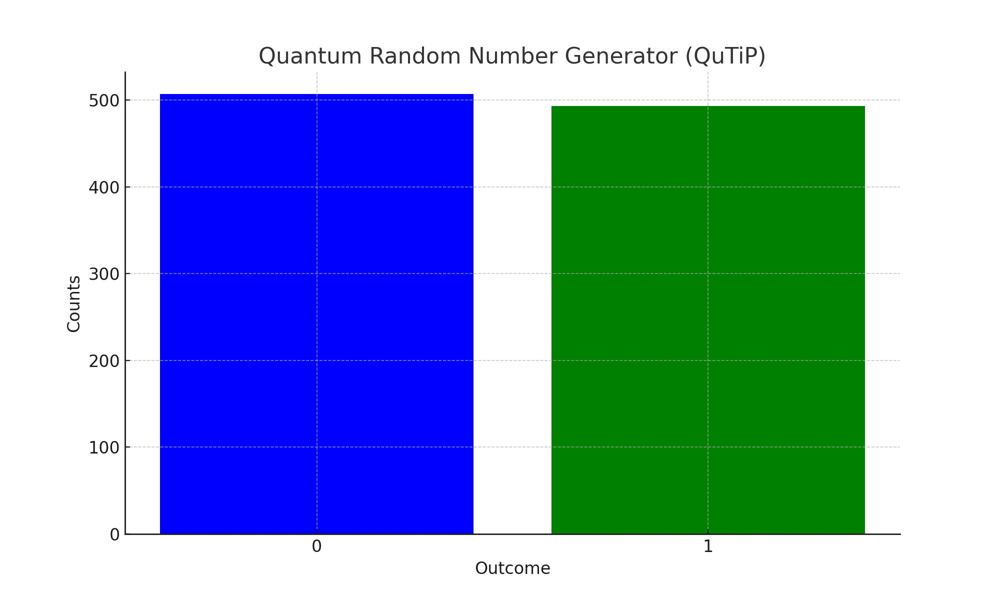

# 🧑‍💻 Quantum Random Number Generator (QRNG) using QuTiP

A fully offline, open-source Quantum Computing project that generates random binary numbers by simulating quantum superposition and measurement using the QuTiP Python library — no cloud, no account, no limits.

## 📌 What This Project Does  

This QRNG uses a qubit initialized into a superposition state via a Hadamard gate. When measured, the qubit collapses probabilistically into either |0⟩ or |1⟩. The outcomes are truly random, simulated via QuTiP’s local quantum framework.

## 🛠️ Tech Stack  

- **Python 3.9+**
- **QuTiP 5.0+**
- **NumPy**
- **Matplotlib**

## 🎮 How It Works  

1. **Create basis states** |0⟩ and |1⟩  
2. **Apply a Hadamard Gate** to |0⟩ (superposition)  
3. **Measure probabilities** of |0⟩ and |1⟩  
4. **Simulate 1000 measurements** with those probabilities  
5. **Display results** with a histogram

## 📊 Example Output  

```
Probability of 0: 0.5
Probability of 1: 0.5
Measurement outcomes over 1000 shots: {0: 507, 1: 493}
```

Histogram output:



## 📦 Installation  

```bash
pip install qutip numpy matplotlib
```

## 📚 Resources  

- [QuTiP Documentation](http://qutip.org/documentation.html)
- [Quantum Randomness Overview (ArXiv)](https://arxiv.org/abs/quant-ph/0101062)

## 📖 About Me  

AI and quantum tech enthusiast from Hyderabad, India — passionate about building projects that merge computer science, artificial intelligence, and emerging quantum technologies.

## 📧 Contact  

- **GitHub:** [Bushiha](https://github.com/Bushiha)
